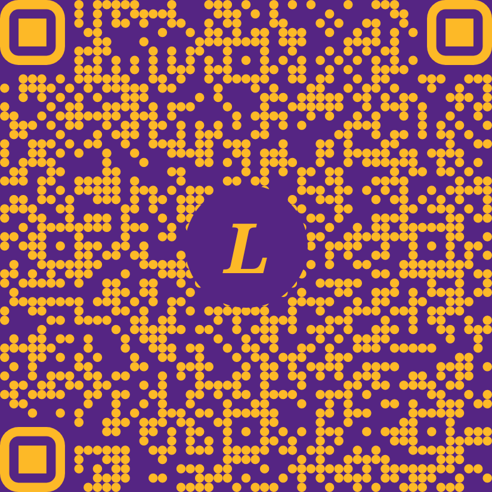
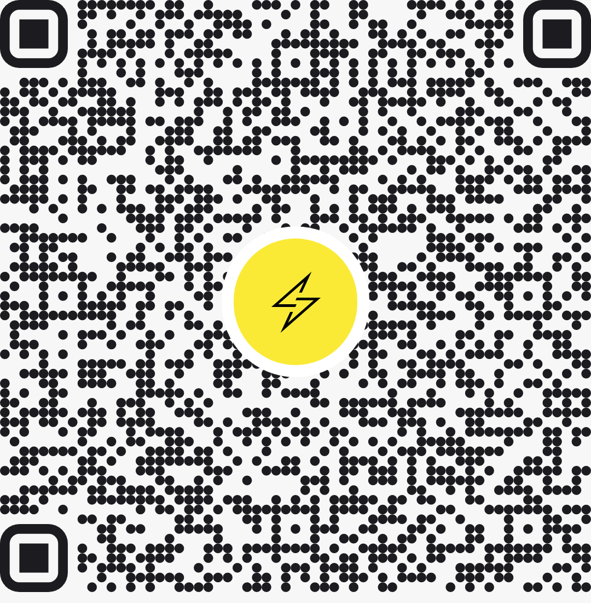
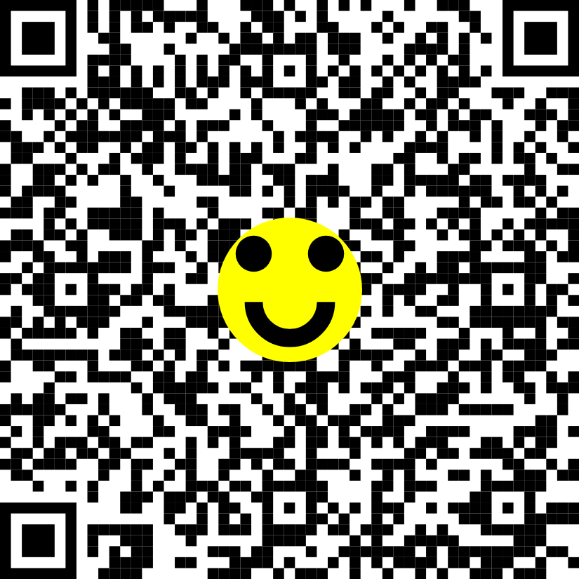
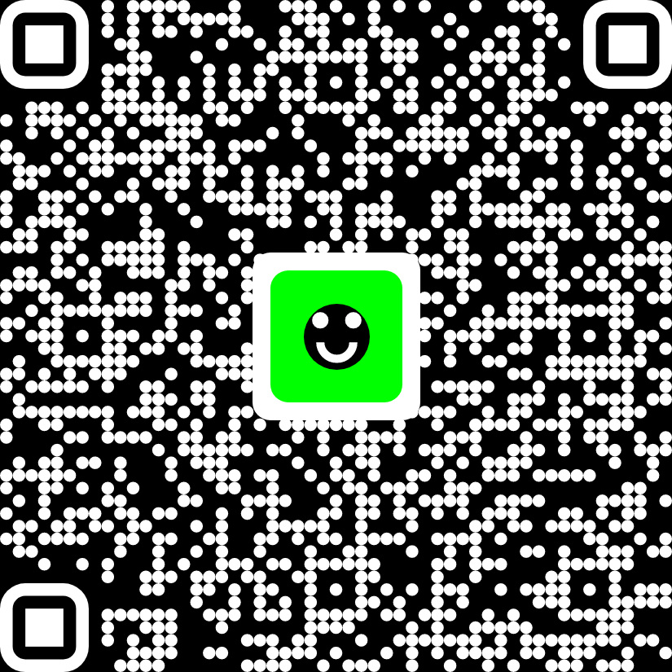
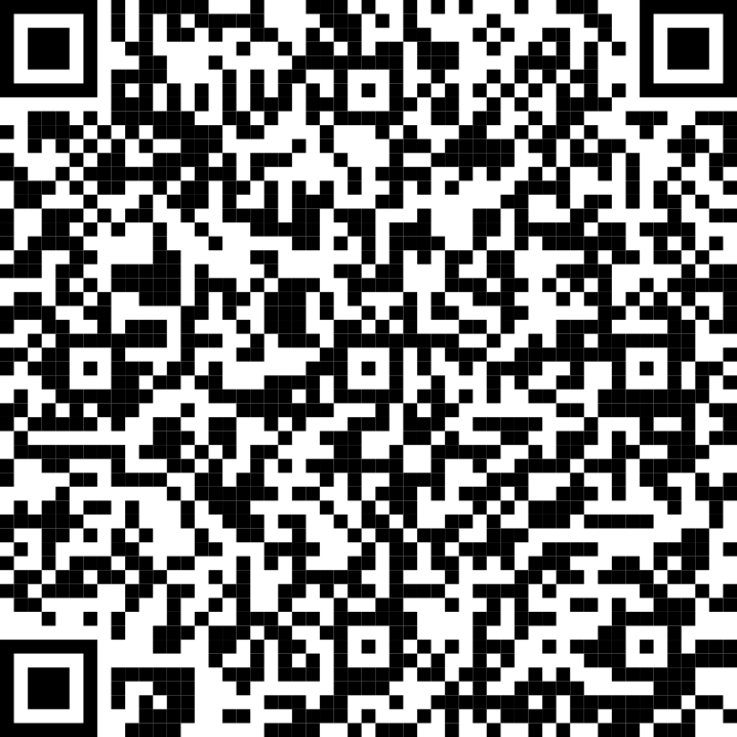

# Compose QR Code
__A simple, flexible QR code renderer for Jetpack Compose - by *Lightspark*__

|  |  |  |  |
| --- | --- | --- | --- |

## Usage

Here's a plain ol' boring QR Code:

<table>
<tr>
<td>

```kotlin
@Composable
fun BoringPreview() {
    QrCodeView(
        data = "https://github.com/lightsparkdev/compose-qr-code",
        modifier = Modifier.size(300.dp)
    )
}
```

</td>
<td>

</td>
</tr>
</table>

Meh... Let's spice it up a bit with a smiley face overlay:

<table>
<tr>
<td>

```kotlin
@Composable
fun SmileyPreview() {
    QrCodeView(
        data = "https://github.com/lightsparkdev/compose-qr-code",
        modifier = Modifier.size(300.dp),
        overlayContent = {
            Box(
                contentAlignment = Alignment.Center,
                modifier = Modifier.fillMaxSize()
            ) {
                Smile(
                    modifier = Modifier.fillMaxSize(),
                    backgroundColor = Color.Yellow,
                    smileColor = Color.Black
                )
            }
        }
    )
}
```

</td>
<td>

</td>
</tr>
</table>

Cool, I guess we're getting somewhere. What about dark mode? Maybe we can also add some style with circular dots in the qr code...

<table>
<tr>
<td>

```kotlin
@Composable
fun SmileyDarkPreview() {
    QrCodeView(
        data = "https://github.com/lightsparkdev/compose-qr-code",
        modifier = Modifier.size(300.dp),
        colors = QrCodeColors(
            background = Color.Black,
            foreground = Color.White
        ),
        dotShape = DotShape.Circle,
        overlayContent = {
            Box(
                contentAlignment = Alignment.Center,
                modifier = Modifier
                    .fillMaxSize()
                    .clip(RoundedCornerShape(8.dp))
                    .background(Color.White)
                    .padding(8.dp)
                    .clip(RoundedCornerShape(8.dp))
                    .background(Color.Green)
            ) {
                Smile(modifier = Modifier.fillMaxSize(0.5f))
            }
        })
}
```

</td>
<td>

</td>
</tr>
</table>


That's not bad! Let's add some even cooler styles, though. *cracks fingers*...

<table>
<tr>
<td>

```kotlin
@Composable
fun PurpleAndGold() {
    val purple = Color(0xFF552583)
    val gold = Color(0xFFFDB927)
    QrCodeView(
        data = URL_DATA,
        modifier = Modifier.size(300.dp),
        colors = QrCodeColors(
            background = purple,
            foreground = gold
        ),
        dotShape = DotShape.Circle,
        overlayContent = {
            Box(
                contentAlignment = Alignment.Center,
                modifier = Modifier
                    .fillMaxSize()
                    .clip(CircleShape)
                    .background(purple)
            ) {
                BasicText(
                    text = "L",
                    style = TextStyle.Default.copy(
                        color = gold,
                        fontSize = 42.sp,
                        fontWeight = FontWeight.ExtraBold,
                        fontStyle = FontStyle.Italic,
                        fontFamily = FontFamily.Serif
                    )
                )
            }
        }
    )
}
```

</td>
<td>

</td>
</tr>
</table>

## Acknowledgements 

This libraries relies on the great, reliable [zxing](https://github.com/zxing/zxing) library for QR code data generation.
